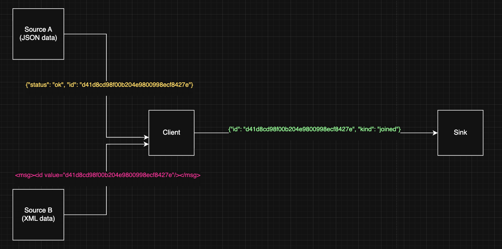
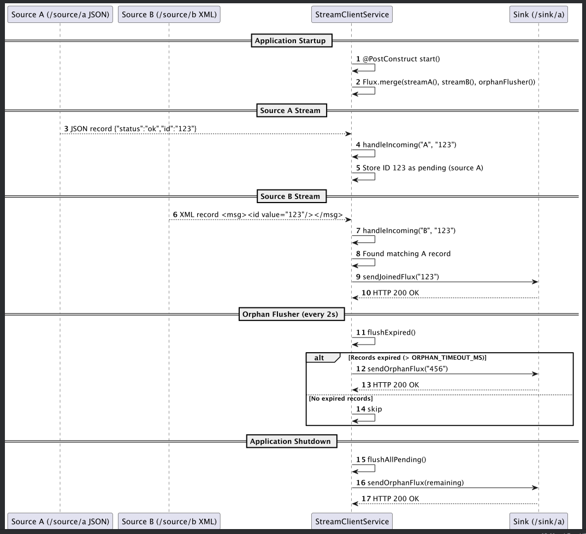
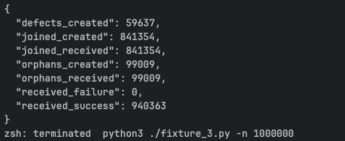

# Java Client for Asynchronous Data Join Challenge

This solution implements a `real-time asynchronous event matching system` designed to process continuous data streams from two independent sources and publish categorized results to a downstream sink service.

## Overview

This project implements a **real-time asynchronous client** that connects to a Python-based fixture server.  
It continuously streams data from two independent endpoints, matches records across them, and sends categorized results back to a sink endpoint.

The client is designed to:
1. Read records from `/source/a` (JSON) and `/source/b` (XML).
2. Match records across both sources to detect “joined” or “orphaned” relationships.
3. Ignore malformed or defective records.
4. Submit results to `/sink/a` as JSON payloads.

---
### Core Workflow

Steps:

* Asynchronously pull data from /source/a and /source/b.
* Parse and validate each record.
* Store unpaired records temporarily.
* When matching IDs appear across both sources → mark "joined".
* If a record remains unmatched beyond timeout → mark "orphaned".
* Send categorized results to /sink/a.
---

## Architecture

> **Note:** This client follows `Hexagonal Architecture` (Ports and Adapters).
> I chose this approach to keep the core business logic independent of external systems, making it easier to test, maintain, and swap out data sources or sinks without changing the main logic.

The Java client follows a modular, event-driven architecture centered around four key asynchronous components:

### 1. Source Streamers
- **SourceAReader**: Continuously fetches JSON data from `/source/a`.
- **SourceBReader**: Continuously fetches XML data from `/source/b`.
- Each reader runs in its own asynchronous loop (via `CompletableFuture` or executor services).
- Parsed records are handed off to record handlers for processing.

### 2. Record Handlers
Each incoming record is validated and matched using in-memory state maps:
- `pendingA`: Records seen only from source A.
- `pendingB`: Records seen only from source B.
- `joinedIds`: Successfully matched record IDs.
- `defectiveIds`: Malformed or invalid records ignored from processing.

When a match is found across A and B, the record is marked as `"joined"` and queued for submission to `/sink/a`.

### 3. Sink Writer
- Continuously dequeues ready-to-submit records from a thread-safe `BlockingQueue`.
- Sends JSON POST requests to `/sink/a`:
  ```json
  { "id": "<hash>", "kind": "joined" | "orphaned" }
Retries automatically when the server returns HTTP 406 (“must read or write somewhere else first”).

Uses exponential backoff between retries.

### 4. Orphan Flusher

* Runs periodically (scheduled executor).
* Scans pending A/B maps for records that exceed a timeout threshold (ORPHAN_TIMEOUT).
* Marks them as "orphaned" and enqueues them for sink submission.
* Prevents memory buildup by trimming large caches.


---

#### Thread Responsibilities

| Thread / Task   | Description                                    |
| --------------- | ---------------------------------------------- |
| `SourceAReader` | Reads and parses JSON events from `/source/a`. |
| `SourceBReader` | Reads and parses XML events from `/source/b`.  |
| `SinkWriter`    | Submits joined/orphaned records to `/sink/a`.  |
| `OrphanFlusher` | Periodically checks for timed-out records.     |


### Testing

* JUnit tests are available under src/test/java/...:
* SourceReaderTest – validates stream parsing and malformed record handling.
* RecordHandlerTest – verifies joining/orphaning logic.
* SinkWriterTest – mocks /sink/a and checks retry logic.
* IntegrationTest – end-to-end run against the fixture server.

Tested for 1M records


> please change the `final_wait` attribute in server side to higher value so we give enough time for the data to sink

### Configuration

All runtime parameters are configurable via environment variables or CLI args:

| Parameter          | Default     | Description                               |
| ------------------ | ----------- | ----------------------------------------- |
| `HOST`             | `localhost` | Server hostname                           |
| `PORT`             | `7299`      | Server port                               |
| `ORPHAN_TIMEOUT`   | `5s`        | Timeout before declaring orphaned records |
| `POST_RETRY_DELAY` | `1s`        | Initial retry delay for 406 responses     |
| `MAX_PENDING_SIZE` | `10000`     | Trim limit for pending record caches      |


### Running the Project
#### Prerequisites

* Java 11 or higher
* Gradle for dependency management
* Python fixture server (from challenge repo)

Start the Server

Run the provided Python fixture (server side):`python fixture_3.py -n 500000`

Run the Client `java -jar target/client.jar --host localhost --port 7299`

The client will begin streaming, processing, and sending records to `/sink/a`.

### Assumptions

* Each record ID appears at most once per source.
* Order of sink submissions is not important.
* Defective (malformed) records are ignored but logged.
* 406 responses indicate dependency between endpoints — handled via retry logic.
* Client can run indefinitely for streaming workloads.

### Improvements

Future improvements to enhance robustness and performance:

* Add structured logging (e.g., SLF4J + JSON appenders)
* Support graceful shutdown with pending queue flush
* Add metrics (joined/orphaned counts) via JMX or Prometheus
* Implement circuit breaker for repeated sink errors
* Allow runtime reconfiguration via .properties file or CLI flags